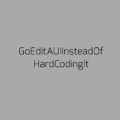
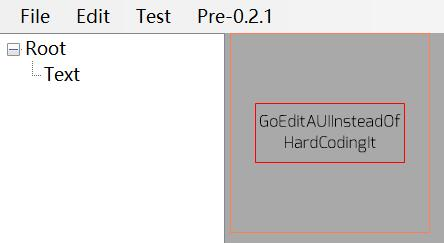
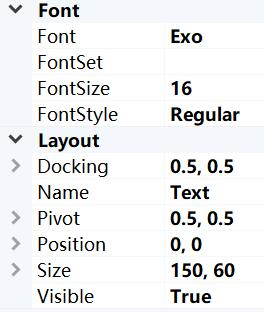
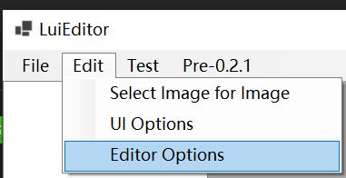

<div align="center">

# LunaUI

[](#)
[](#)
[](./blob/main/LICENSE)

A structured image generator for your bots with a light-weight graphic ui editor.

</div>

## Getting Started

> LunaUI is under develop and (centainly) can produce bugs = =#. Please use with care () 
> 
> Features marked with 'experimental' may be altered or removed in future.

`LunaUI` is structured image generator which you can include in your bot projects for image generate purposes. 

`LunaEdit` or `LuiEditor` is a graphical editor for `LunaUI`.
`LuiEditor` use `LunaUI` as its image rendering backend, so your editer result is fully reproducible in bots.

[Manual](/docs/README.md)

## Example

```c#
LunaUI.LunaUI ui = new(YourWorkPath, "Examples/Text.json");

ui.GetNodeByPath<LuiText>("name").Text = "GoEditAUIInsteadOfHardCodingIt";

Image im = ui.Render();

// Send or store it
```

Render result:



----

LuiEditor render result (with layout rect)



Properties for Text:



You can see how these params work with this example.
`Pivot=(0.5, 0.5)` and `Docking=(0.5,0.5)` makes Text centered in root layout.

---

Json content for text example:

```json
{
  "ui_options": {
    "text_kerning_config": null
  },
  "layouts": {
    "name": "Root",
    "position": "0, 0",
    "pivot": "0, 0",
    "docking": "0, 0",
    "size": "200, 200",
    "visible": true,
    "auto_size_x": false,
    "auto_size_y": false,
    "sub_layouts": [
      {
        "$type": "LunaUI.LuiText, LunaUI",
        "placeholder": "GoEditAUIInsteadOfHardCodingIt",
        "text_render_mode": 0,
        "kerning": 1.0,
        "font_name": "Exo",
        "font_pixel_size": 16.0,
        "font_style": 0,
        "text_color": "255, 0, 0, 0",
        "text_align_horizontal": 1,
        "text_align_vertical": 1,
        "shade_enabled": false,
        "shade_color": "0, 0, 0, 0",
        "shade_offset": 1.0,
        "shade_size": 1.0,
        "border_enabled": false,
        "border_color": "0, 0, 0, 0",
        "border_offset": 1.0,
        "auto_size_by_placeholder": false,
        "name": "Text",
        "position": "0, 0",
        "pivot": "0.5, 0.5",
        "docking": "0.5, 0.5",
        "size": "150, 60",
        "visible": true,
        "auto_size_x": false,
        "auto_size_y": false,
        "sub_layouts": []
      }
    ]
  }
}
```

## Editor Guide

[Binary Releases](https://github.com/InariAimu/LunaUI/releases)

**WARNING: Always save before exit or close window. There is no save warning in this version.**

First set your work path from `Menu -> Edit -> Editor Options` Options:



These configs are saved in `config.json`.

Then you can create or open a ui (json) file from `Menu -> File`.

UI size is adjusted through `Root` node's Size property.

ImageLayout's image is setted through `Menu -> Edit -> Select Image for Image`. Select imageLayout first.

Move layouts by mouse is not supported now. Click to select them. Please edit it in the properties window.

## License

GNU GPL v3

> TrueType: from [RoyT.TrueType](https://github.com/roy-t/TrueType) with [MIT license](TrueType/LICENSE).
