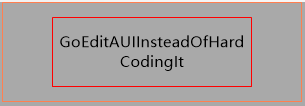
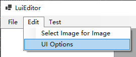

<div align="center">

# LunaUI

[](#)
[](./blob/main/LICENSE)

A structured image generator for your bots with an editor.

</div>

## Getting Started

> LunaUI is under develop and (centainly) can produce bugs = =#. Please use with care () 
> 
> Also include experimental features may be altered in the future.

`LunaUI` is an image render which you can include in your bot projects for image generate purposes. 

`LunaEdit` or `LuiEditor` is a graphical editor for `LunaUI`.
`LuiEditor` use `LunaUI` as its image rendering backend, so your editer results is fully reproducible in bots.

## Example

```c#
LunaUI.LunaUI ui = new(YourWorkPath, "Examples/Text.xml");

ui.GetNodeByPath<LuiText>("name").Text = "GoEditAUIInsteadOfHardCodingIt";

Image img = ui.Render();

// Send or store it
```



> For langs other than C#:
> 
> Direct use of xml file saved by LuiEditor is possible, but not recommanded. They are ill-formed and generated by `System.Xml.Serialization`. Export of well-formed xml or json is sheduled in future release.

## Editor Guide

[Binary Releases](https://github.com/InariAimu/LunaUI/releases)

First set your work path from `Menu -> Edit -> UI` Options:



Then you can create or open a ui (xml) file from `Menu -> File`.

UI size is adjusted through `Root` node's Size property.

ImageLayout's image is setted through `Menu -> Edit -> Select Image for Image`. Select imageLayout first.

Move layouts by mouse is not supported now. Please edit it in the properties window.

**WARNING: Always save before exit or close window. There is no save warning in this version.**
